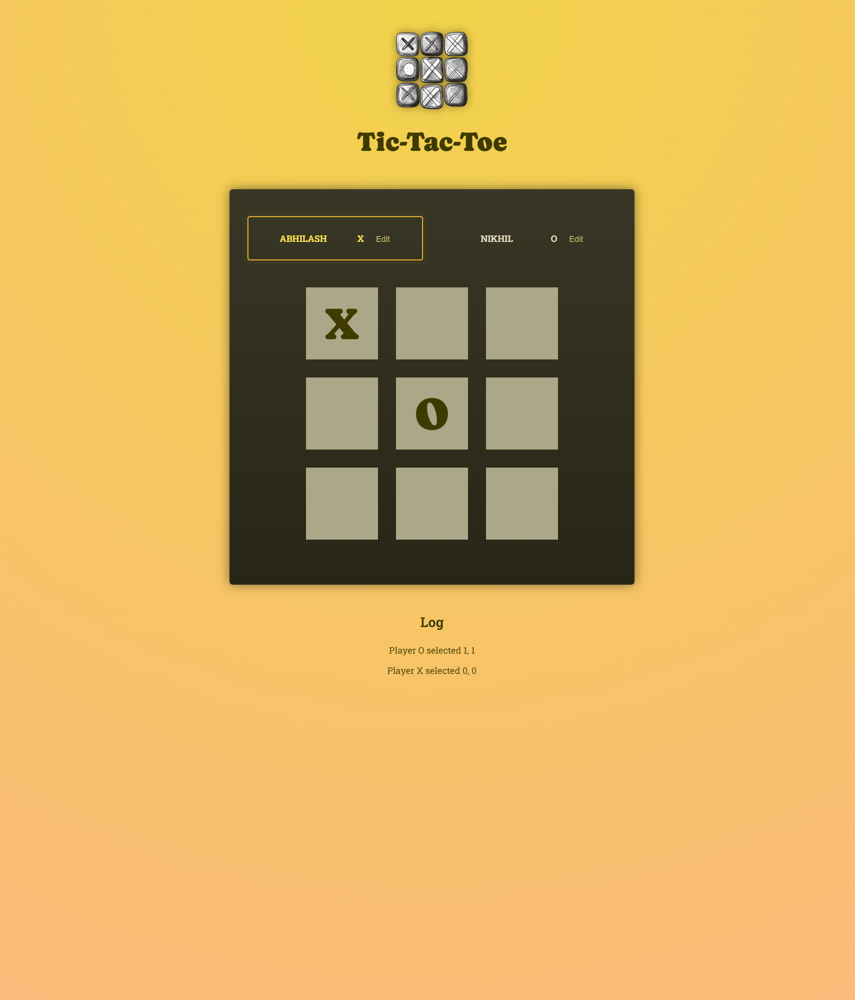
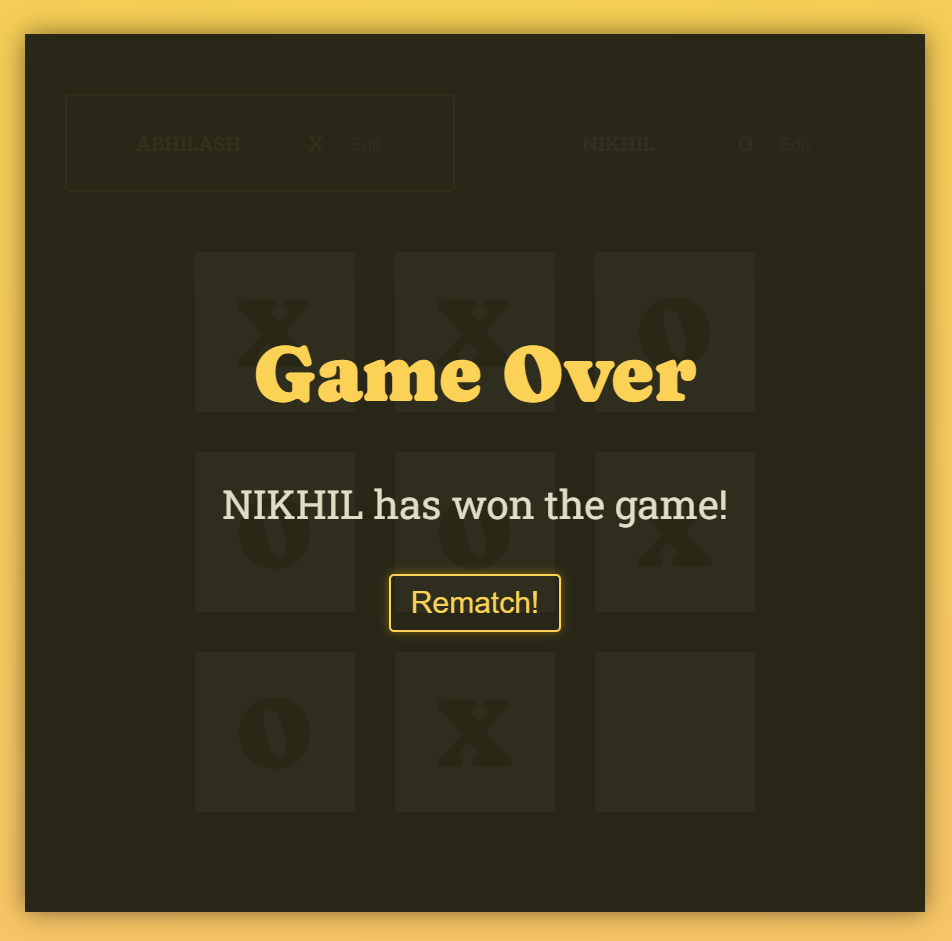

# Tic-Tac-Toe (React + Vite)

A small Tic-Tac-Toe game built with React and Vite. This repo demonstrates a compact component structure, simple game logic, and a deploy-ready setup for GitHub Pages.

Demo: https://tic-tac-toe-nu-lilac.vercel.app/

## Features

- Two-player Tic-Tac-Toe board
- Turn log
- Game over detection and rematch
- Editable player names

## Tech

- React (v19)
- Vite

## Quick Start

Prerequisites
- Node.js (Recommended: 18+)
- npm (bundled with Node)

Install dependencies

```powershell
npm install
```

Run development server

```powershell
npm run dev
```

Build for production

```powershell
npm run build
```

Preview production build locally

```powershell
npm run preview
```

```powershell
npm run deploy
```

Notes about deploying with Vite/GitHub Pages

- The site is hosted at `https://<username>.github.io/<repo>/` (for user/organization pages the path differs).
- Vite must know the `base` path so built asset URLs include the repo name. This project sets `base: '/tic-tac-toe/'` in `vite.config.js`. If you rename the repo or change the deployment path, update `vite.config.js` and the `homepage` field in `package.json` accordingly.

## Project structure

```
index.html
package.json
vite.config.js
src/
	App.jsx
	index.jsx
	index.css
	winning-combinations.js
	assets/
	components/
		gameboard/
			GameBoard.jsx
		player/
			player.jsx
		log/
			log.jsx
		gameover/
			gameover.jsx
```

## Important implementation notes

- The players list is rendered in `App.jsx` (`<ol id="players" ...>`). The active player is highlighted by adding `class="highlight-player"` to the parent `#players` and `class="active"` on the player `<li>` element (see `player.jsx`).
- Player edits call an `onSave` callback passed from the parent; `player.jsx` uses a functional state updater so Save triggers correctly on the first click.
- The `GameOver` component uppercases the winner for emphasis.

## Troubleshooting

	- Ensure `vite.config.js`'s `base` is set to `'/<repo-name>/'` (for this repo: `'/tic-tac-toe/'`).
	- Ensure `package.json` `homepage` is set to your GitHub Pages URL.
	- Confirm the `gh-pages` branch is active in the repository settings if you used a manual deploy.
Deployment

This project is deployed on Vercel: https://tic-tac-toe-nu-lilac.vercel.app/

To deploy: connect the repository to Vercel and use the default build command (`npm run build`) and output directory (`dist`). Vercel automatically handles the base path and asset routing, so no additional `base` configuration is required in `vite.config.js`.

- Nothing renders locally:
	- Open the browser devtools console to check for errors and missing imports.
	- Verify `index.jsx` mounts the app to `<div id="root"></div>` in `index.html`.

## Contributing

Small fixes and improvements welcome. Open a PR and describe the change.

## License

This project is released under the MIT License. See `LICENSE` if present or add one if you plan to open-source.


## Screenshots



